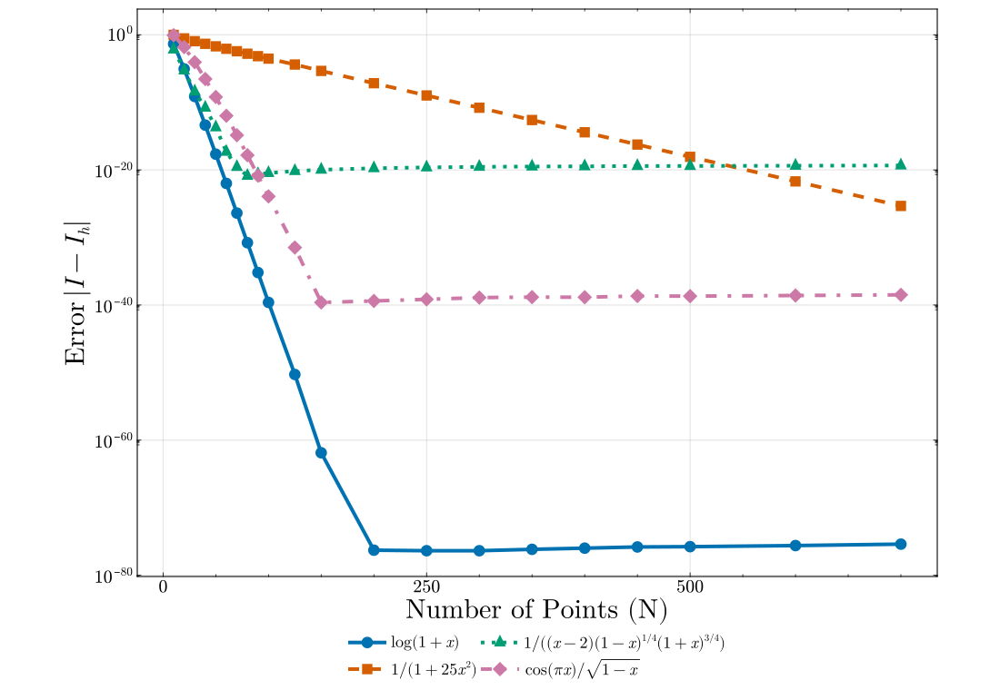

# Summary

Numerical integration is a cornerstone of scientific computing, essential for evaluating integrals that cannot be solved analytically. The Tanh-Sinh (or Double Exponential) quadrature, originally proposed by @Takahasi1973, is a powerful technique known for its high accuracy and efficiency, particularly for integrands with endpoint singularities. `FastTanhSinhQuadrature.jl` provides a high-performance, arbitrary-precision implementation of this method in Julia. It leverages modern compiler technologies to achieve significant speedups over traditional implementations while maintaining rigorous mathematical precision.

# Statement of Need

In many fields of physics and engineering, researchers encounter integrals with singularities at the boundaries. Standard Gaussian quadrature rules often fail or require an excessive number of points to converge in these cases. While other integration libraries exist, they typically lack a combination of robustness, performance, and flexibility. `FastTanhSinhQuadrature.jl` addresses these needs by:

1.  **Robustness**: Automatically handling endpoint singularities without manual coordinate transformations.
2.  **Performance**: Utilizing SIMD (Single Instruction, Multiple Data) instructions for rapid evaluation.
3.  **Flexibility**: Supporting arbitrary precision types (e.g., `BigFloat`) and multidimensional integration.

This package implements a rigorous Tanh-Sinh scheme with an optimized "window selection" strategy enabling SIMD-accelerated execution paths, making it ideal for large-scale simulations where both speed and precision are critical.

# State of the field

Numerical integration is a well-established field, with mature implementations in libraries such as **Boost** [@Boost] (C++), **SciPy** [@Virtanen2020] (Python), and **mpmath** [@Johansson_mpmath] (Python). Within the Julia ecosystem, packages like `QuadGK.jl` [@QuadGK] and `HCubature.jl` [@HCubature] provide detailed adaptive Gauss-Kronrod and h-adaptive cubature methods. However, high-performance implementations specifically of the **Tanh-Sinh quadrature** are less common.

Most existing Tanh-Sinh implementations rely on dynamic convergence checks within the summation loop. This introduces conditional branching that prevents modern compilers from applying SIMD vectorization, restricting solvers to scalar execution speeds. `FastTanhSinhQuadrature.jl` overcomes this by adopting the "window selection" strategy described by @Vanherck2020. By analytically pre-calculating the optimal step size $h$ and truncation index $n$ based on floating-point precision, the algorithm eliminates runtime checks, creating a branch-free inner loop amenable to optimization by `LoopVectorization.jl` [@LoopVectorization].

# Mathematics

The Tanh-Sinh quadrature computes integrals of the form $I = \int_{-1}^{1} f(x) \, \mathrm{d}x$ by applying the variable transformation $x = \tanh(\frac{\pi}{2} \sinh(t))$ proposed by @Takahasi1973. This maps the finite interval to the real line, where the integrand decays double-exponentially. The integral is then approximated using the trapezoidal rule over the infinite domain, truncated to a finite window $[-n, n]$.

For a detailed derivation of the quadrature weights, error bounds, and the window selection strategy used to determine $h$ and $n$, the reader is referred to @Takahasi1973 and @Vanherck2020.

# Software Design

The package balances ease of use with maximum performance through a two-tier API:

1.  **High-Level API** (`quad`): A drop-in replacement for standard quadrature functions, handling adaptivity, singularities, and infinite domains automatically.
2.  **Low-Level API** (`integrateND_avx`): Allows users to pre-compute quadrature nodes and weights for reuse across millions of integrals, eliminating allocation overhead in tight loops.

Key implementation features include:

*   **Window Selection**: Uses the method of @Vanherck2020 to pre-determine integration bounds, enabling branch-free loops.
*   **SIMD Optimization**: Leverages `LoopVectorization.jl` to vectorize evaluation loops, yielding 2-3x speedups over scalar codes.
*   **Static Allocation**: For moderate node counts, weights and nodes can be stored in `StaticArrays`, eliminating heap allocations.
*   **Arbitrary Precision**: Supports generic number types (`BigFloat`, `Double64`) by dynamically deriving quadrature parameters from machine epsilon.

# Research Impact

`FastTanhSinhQuadrature.jl` has been integrated as a backend for `Integrals.jl` [@Integrals], ensuring widespread availability within the SciML ecosystem.

## Performance

Figure 1 summarizes benchmarks against `FastGaussQuadrature.jl` [@FastGaussQuadrature], `QuadGK.jl` [@QuadGK], `HCubature.jl` [@HCubature], `Cubature.jl` [@Cubature], and `Cuba.jl` [@Cuba]. All benchmarks use `rtol = 10^{-6}` and `atol = 10^{-8}`; external adaptive solvers are capped at 200,000 evaluations. For each benchmark case, the plotted speedup is measured relative to the fastest competing method that also met the requested tolerance.

The results show two distinct usage regimes. The high-level `quad` interface is most compelling for endpoint-singular integrands: in 1D it is about **6.7x** faster than `QuadGK.jl` on $(1-x^2)^{-1/2}$ and about **2.2x** faster on $\log(1-x)$, while in the tested 2D endpoint-singular case it is more than three orders of magnitude faster than the fastest accurate alternative. The SIMD path (`integrate*_avx`) is the main performance-oriented API: it is the fastest accurate method in 7 of the 9 directly comparable benchmarks, and it remains competitive or superior across many singular and smooth tensor-product problems.

These benchmarks also clarify the package's limitations. `FastTanhSinhQuadrature.jl` should be preferred when the integrand has endpoint singularities, when the same quadrature rule can be reused across many evaluations, or when arbitrary precision is required. It is less advantageous for smooth low-dimensional problems where specialized Gauss or Gauss-Kronrod rules already match the integrand well; for example, `FastGaussQuadrature.jl` and `QuadGK.jl` are faster on the smooth 1D polynomial and Runge-function tests, and `Cuba.jl`/`Cubature.jl` can outperform the adaptive `quad` interface on some smooth 3D problems. Interior singularities are likewise not handled automatically and still require domain splitting via `quad_split`.


Detailed performance benchmarks, timing tables, and convergence plots are available in the [software repository](https://github.com/svretina/FastTanhSinhQuadrature.jl).

# Usage

## Installation

```julia
using Pkg
Pkg.add("FastTanhSinhQuadrature")
```

## Basic Integration

```julia
using FastTanhSinhQuadrature

# Integrate exp(x) from 0 to 1
val = quad(exp, 0.0, 1.0) # ≈ 1.71828...

# Handle singularities: 1/sqrt(x)
val = quad(x -> 1/sqrt(x), 0.0, 1.0) # ≈ 2.0
```

## High-Performance Pre-computation

```julia
# Pre-compute nodes/weights for Float64
x, w, h = tanhsinh(Float64, Val(80))

# Reuse in tight loops (zero-allocation)
f(t) = sin(t)^2
integral = integrate1D_avx(f, 0.0, π, x, w, h)
```

# Convergence

Convergence tests for various integrands are shown below. The method exhibits rapid exponential convergence characteristic of the Tanh-Sinh scheme.



# Future Work and Contributions

Natural directions for future development include more automatic handling of interior singularities and oscillatory integrands, broader performance tuning across CPU architectures, and expanded benchmark coverage across precisions and problem classes. The current multidimensional routines remain specialized to low-dimensional tensor-product domains, so extending this scope is another natural area for future work.

The package is developed openly on GitHub, and contributions are welcome through issues and pull requests. Particularly useful contributions include new benchmark cases, additional tests and examples, documentation improvements, performance regressions or optimizations, and extensions of the existing `Integrals.jl` interface.

# AI usage disclosure

During the development of this package, the author utilized Gemini (Google) for assistance with documentation, debugging and the generation of the first draft of this paper. The author has reviewed and edited all AI-generated content to ensure accuracy and adherence to the package's coding standards.

# Acknowledgements

The author acknowledges the developers of `LoopVectorization.jl` for providing the tools that enabled the performance optimizations in this package.

# References
