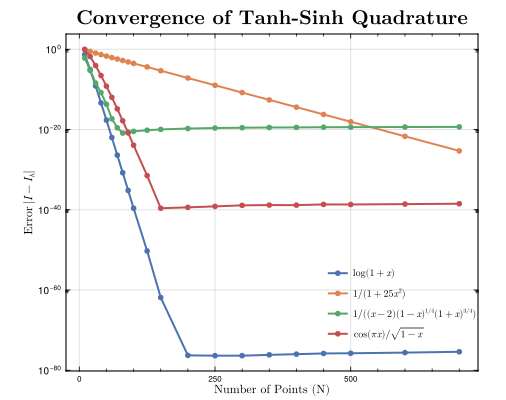

# FastTanhSinhQuadrature.jl

[](https://svretina.github.io/FastTanhSinhQuadrature.jl/stable/)
[](https://svretina.github.io/FastTanhSinhQuadrature.jl/dev/)
[](https://github.com/svretina/FastTanhSinhQuadrature.jl/actions/workflows/CI.yml?query=branch%3Amaster)
[](https://codecov.io/gh/svretina/FastTanhSinhQuadrature.jl)
[](https://github.com/JuliaTesting/Aqua.jl)
[](https://github.com/aviatesk/JET.jl)
[](https://joss.theoj.org/papers/84c42780ad01b47c0c3b5f1ab5c26260)


Fast and high-precision numerical integration using **Tanh-Sinh (Double Exponential) quadrature** in Julia.

## Overview

`FastTanhSinhQuadrature.jl` is designed for high-performance numerical integration, particularly effective for functions with endpoint singularities. It combines the rigorous accuracy of Tanh-Sinh quadrature with modern Julia performance features like SIMD acceleration.

### Key Features
- **Arbitrary Precision Support**: Seamlessly works with `Float32`, `Float64`, `BigFloat`, and extended precision types like `Double64` (from `DoubleFloats.jl`).
- **High Performance**: Specialized `integrate1D_avx`, `integrate2D_avx`, `integrate3D_avx` routines utilize `LoopVectorization.jl` for maximum speed.
- **Multidimensional Support**: Built-in support for **1D**, **2D**, and **3D** integration domains.
- **Memory Efficiency**: Pre-compute quadrature nodes and weights once and reuse them for multiple integrations.
- **Singularity Handling**: Robust handling of functions with singularities at integration boundaries via `quad_split` and the new **Complement Interface** `quad_cmpl`.
- **Double Exponential Convergence**: Achieve machine precision with few points even for singular integrands.
- **Adaptive Integration**: Highly optimized adaptive routines for 1D, 2D, and 3D.
- **Transcendental Caching**: 2D and 3D adaptive routines cache node and weight mappings, reducing transcendental overhead by $O(N^{d-1})$.
- **Optimal and maximal spacing**: Optimal spacing of nodes and weights for maximum accuracy.
- **Underflow/Overflow Handling**: Robust handling of underflow/overflow when generating nodes and weights.
- **Type Stable**: Rigorously tested with `JET.jl` to ensure type stability and zero runtime dispatch.

<p align="center">
  
</p>

## Installation

Install directly from the Julia REPL:

```julia
import Pkg
Pkg.add("FastTanhSinhQuadrature")
```

## Quick Start

### High-Level API: `quad`

The simplest way to integrate is using the `quad` function, which provides adaptive integration:

```julia
using FastTanhSinhQuadrature

# Integrate exp(x) from 0 to 1
val = quad(exp, 0.0, 1.0)
println(val)  # ≈ e - 1 ≈ 1.7182818...

# Integrate over default domain [-1, 1]
val = quad(x -> 3x^2)
println(val)  # ≈ 2.0

# Handle singularities with quad_split
f(x) = 1 / sqrt(abs(x))  # Singular at x=0
val = quad_split(f, 0.0, -1.0, 1.0)  # Split at singularity
println(val)  # ≈ 4.0
```

### High-Accuracy Interface: `quad_cmpl`

For functions extremely sensitive near endpoints (e.g., $1-x$ or $1+x$), use `quad_cmpl`. The function `f` should accept three arguments: `f(x, 1-x, 1+x)`.

```julia
using FastTanhSinhQuadrature

# Integrate f(x) = 1/sqrt(1-x^2) using complementary coordinates
# 1-x^2 = (1-x)(1+x)
f(x, omx, opx) = 1 / sqrt(omx * opx)
val = quad_cmpl(f, -1.0, 1.0)
println(val)  # ≈ π ≈ 3.14159...
```

### Pre-computed Nodes for Maximum Performance

For repeated integrations, pre-compute nodes and weights once:

```julia
using FastTanhSinhQuadrature

# Generate nodes (x), weights (w), and step size (h)
x, w, h = tanhsinh(Float64, 80)

# Integrate multiple functions efficiently
f1(x) = sin(x)^2
f2(x) = cos(x)^2

res1 = integrate1D(f1, 0.0, π, x, w, h)
res2 = integrate1D(f2, 0.0, π, x, w, h)
println("Integrals: $res1, $res2")  # Both ≈ π/2

# Use Val{N} for maximum performance with small N (< 128)
# This returns StaticArrays for nodes and weights, allowing for full SIMD acceleration and zero allocations on the heap.
x_static, w_static, h_static = tanhsinh(Float64, Val(80))
val_static = integrate1D_avx(f1, 0.0, π, x_static, w_static, h_static)
```

### SIMD-Accelerated Integration

For `Float32`/`Float64`, use the `_avx` variants for maximum speed:

```julia
x, w, h = tanhsinh(Float64, 100)

# Standard integration
val1 = integrate1D(exp, x, w, h)

# SIMD-accelerated (2-3x faster)
val2 = integrate1D_avx(exp, x, w, h)
```

### High-Precision Integration

Switch to higher precision types like `BigFloat` or `Double64`:

```julia
using FastTanhSinhQuadrature, DoubleFloats

# Double64 precision (~32 decimal digits)
val = quad(exp, Double64(0), Double64(1); tol=1e-30)

# BigFloat precision (arbitrary)
setprecision(BigFloat, 256)
x, w, h = tanhsinh(BigFloat, 120)
val = integrate1D(exp, x, w, h)
```

### Multidimensional Integration (2D & 3D)

Use `StaticArrays` for defining integration bounds:

```julia
using FastTanhSinhQuadrature, StaticArrays

# 2D: Integrate f(x,y) = x*y over [-1,1] × [-1,1]
x, w, h = tanhsinh(Float64, 40)
low = SVector(-1.0, -1.0)
up  = SVector(1.0, 1.0)
val = integrate2D((x, y) -> x * y, low, up, x, w, h)
println(val)  # ≈ 0.0

# 3D: Integrate constant 1 over unit cube
val = quad((x, y, z) -> 1.0, [0.0, 0.0, 0.0], [1.0, 1.0, 1.0])
println(val)  # ≈ 1.0
```

## API Reference

### High-Level Functions

| Function | Description |
|----------|-------------|
| `quad(f; tol, max_levels)` | Adaptive 1D integration over `[-1, 1]` |
| `quad(f, low, up; tol, max_levels)` | Adaptive 1D integration over `[low, up]` |
| `quad_cmpl(f, low, up; ...)` | High-accuracy 1D integration for `f(x, 1-x, 1+x)` |
| `quad(f, low, up; ...)` | Adaptive 2D/3D integration (accepts `SVector` bounds) |
| `quad_split(f, c; ...)` | Split domain `[-1, 1]` at singularity `c` and integrate |
| `quad_split(f, c, low, up; ...)` | Split domain `[low, up]` at singularity `c` and integrate |

### Pre-computed Integration Functions
| Function | Description |
|----------|-------------|
| `tanhsinh(N)` | Generate Float64 nodes/weights for `N` points |
| `tanhsinh(T, N)` | Generate nodes `x`, weights `w`, step `h` for type `T` |
| `tanhsinh(T, Val(N))` | Generate `SVector` nodes/weights for small `N` (SIMD-ready) |
| `integrate1D(f, N)` | Integrate `f` over `[-1, 1]` using `N` points |
| `integrate1D(T, f, N)` | Integrate `f` over `[-1, 1]` using `N` points in type `T` |
| `integrate1D(f, x, w, h)` | Integrate `f` over `[-1, 1]` using pre-computed nodes |
| `integrate1D(f, low, up, x, w, h)` | Integrate `f` over `[low, up]` using pre-computed nodes |
| `integrate2D(f, x, w, h)` | 2D integration over `[-1, 1]^2` |
| `integrate2D(f, low, up, x, w, h)` | 2D integration over rectangle defined by `low`, `up` |
| `integrate3D(f, x, w, h)` | 3D integration over `[-1, 1]^3` |
| `integrate3D(f, low, up, x, w, h)` | 3D integration over box defined by `low`, `up` |

### SIMD-Accelerated Variants

| Function | Description |
|----------|-------------|
| `integrate1D_avx(f, x, w, h)` | SIMD 1D integration over `[-1, 1]` |
| `integrate1D_avx(f, low, up, x, w, h)` | SIMD 1D integration over `[low, up]` |
| `integrate2D_avx(f, low, up, x, w, h)` | SIMD 2D integration over rectangle |
| `integrate3D_avx(f, x, w, h)` | SIMD 3D integration over `[-1, 1]^3` |
| `integrate3D_avx(f, low, up, x, w, h)` | SIMD 3D integration over box |

### Adaptive Integration Functions

| Function | Description |
| :--- | :--- |
| `adaptive_integrate_1D(T, f, a, b; tol, max_levels)` | Adaptive 1D with explicit type |
| `adaptive_integrate_1D_cmpl(T, f, a, b; ...)` | Adaptive 1D with complement interface |
| `adaptive_integrate_2D(T, f, low, up; ...)` | Adaptive 2D integration (cached nodes) |
| `adaptive_integrate_3D(T, f, low, up; ...)` | Adaptive 3D integration (cached nodes) |

---

## Benchmarks

### Benchmark Environment
- **CPU**: Intel(R) Core(TM) Ultra 7 155U

### Results

Comparison against `FastGaussQuadrature.jl` for various functions.
- `TS`: `integrate1D` (standard Tanh-Sinh)
- `TS SIMD`: `integrate1D_avx` (SIMD-optimized Tanh-Sinh)
- `GQ`: `FastGaussQuadrature.jl` (Gauss-Legendre)

Timings are in nanoseconds (ns).

| Function | Domain | Points | TS (ns) | TS SIMD (ns) | GQ (ns) | Ratio (TS/GQ) | Ratio (TS SIMD/GQ) |
| :--- | :--- | :--- | :--- | :--- | :--- | :--- | :--- |
| exp(x) | [-1, 1] | 5 | 33.09 | 14.27 | 33.03 | 1.00 | 0.43 |
| exp(x) | [-1, 1] | 50 | 322.87 | 81.99 | 176.68 | 1.83 | 0.46 |
| exp(x) | [-1, 1] | 500 | 3374.75 | 782.08 | 1665.50 | 2.03 | 0.47 |
| sin(x)^2 | [-1, 1] | 5 | 40.39 | 23.38 | 32.63 | 1.24 | 0.72 |
| sin(x)^2 | [-1, 1] | 50 | 404.32 | 145.48 | 176.75 | 2.29 | 0.82 |
| sin(x)^2 | [-1, 1] | 500 | 4361.71 | 1409.10 | 1768.40 | 2.47 | 0.80 |
| 1/(1+25x^2) | [-1, 1] | 5 | 3.00 | 3.75 | 17.35 | 0.17 | 0.22 |
| 1/(1+25x^2) | [-1, 1] | 50 | 41.82 | 39.17 | 34.77 | 1.20 | 1.13 |
| 1/(1+25x^2) | [-1, 1] | 500 | 477.21 | 213.24 | 320.39 | 1.49 | 0.67 |
| sqrt(1-x^2) | [-1, 1] | 5 | 4.06 | 4.69 | 20.31 | 0.20 | 0.23 |
| sqrt(1-x^2) | [-1, 1] | 50 | 68.01 | 45.31 | 69.68 | 0.98 | 0.65 |
| sqrt(1-x^2) | [-1, 1] | 500 | 636.53 | 313.13 | 743.43 | 0.86 | 0.42 |
| x^2 | [-1, 1] | 5 | 2.01 | 3.04 | 19.86 | 0.10 | 0.15 |
| x^2 | [-1, 1] | 50 | 17.72 | 21.68 | 38.07 | 0.47 | 0.57 |
| x^2 | [-1, 1] | 500 | 213.31 | 54.97 | 273.19 | 0.78 | 0.20 |
| log(1-x) | [-1, 1] | 5 | 38.06 | 30.29 | 34.32 | 1.11 | 0.88 |
| log(1-x) | [-1, 1] | 50 | 371.88 | 187.29 | 214.70 | 1.73 | 0.87 |
| log(1-x) | [-1, 1] | 500 | 4117.38 | 1978.80 | 2117.80 | 1.94 | 0.93 |

*Note: The SIMD-optimized `integrate1D_avx` uses `LoopVectorization.jl` and achieves significant speedups, especially for smooth functions.*
