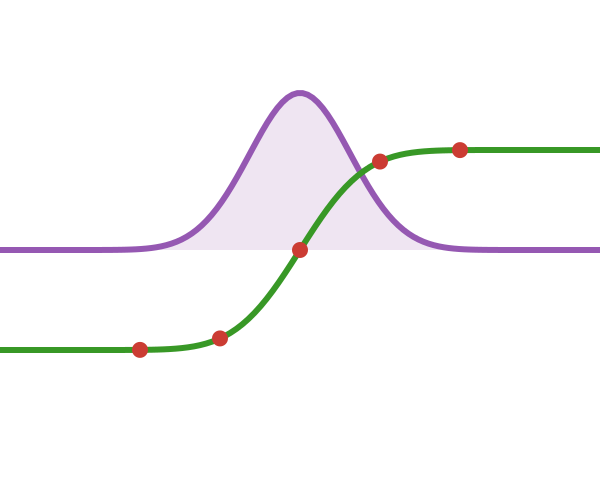

# FastTanhSinhQuadrature.jl

[](https://svretina.github.io/FastTanhSinhQuadrature.jl/stable/)
[](https://svretina.github.io/FastTanhSinhQuadrature.jl/dev/)
[](https://github.com/svretina/FastTanhSinhQuadrature.jl/actions/workflows/CI.yml?query=branch%3Amaster)
[](https://codecov.io/gh/svretina/FastTanhSinhQuadrature.jl)
[](https://github.com/JuliaTesting/Aqua.jl)
[](https://github.com/aviatesk/JET.jl)
[](https://joss.theoj.org/papers/84c42780ad01b47c0c3b5f1ab5c26260)


Fast and high-precision numerical integration using **Tanh-Sinh (Double Exponential) quadrature** in Julia.

## Overview

`FastTanhSinhQuadrature.jl` is designed for high-performance numerical integration, particularly effective for functions with endpoint singularities. It combines the rigorous accuracy of Tanh-Sinh quadrature with modern Julia performance features like SIMD acceleration.

### Key Features
- **Arbitrary Precision Support**: Seamlessly works with `Float32`, `Float64`, `BigFloat`, and extended precision types like `Double64` (from `DoubleFloats.jl`).
- **High Performance**: Specialized `integrate1D_avx`, `integrate2D_avx`, `integrate3D_avx` routines utilize `LoopVectorization.jl` for maximum speed.
- **Multidimensional Support**: Built-in support for **1D**, **2D**, and **3D** integration domains.
- **Flexible Bound Types**: Pre-computed and high-level interfaces accept mixed `Real` bounds (for example `Int`, `Float64`, and `π`) and convert them safely to the node type.
- **Memory Efficiency**: Pre-compute quadrature nodes and weights once and reuse them for multiple integrations.
- **Singularity Handling**: Robust handling of functions with singularities at integration boundaries via `quad_split` and the new **Complement Interface** `quad_cmpl`.
- **Double Exponential Convergence**: Achieve machine precision with few points even for singular integrands.
- **Adaptive Integration**: Highly optimized adaptive routines for 1D, 2D, and 3D.
- **Transcendental Caching**: 2D and 3D adaptive routines cache node and weight mappings, reducing transcendental overhead by $O(N^{d-1})$.
- **Optimal and maximal spacing**: Optimal spacing of nodes and weights for maximum accuracy.
- **Underflow/Overflow Handling**: Robust handling of underflow/overflow when generating nodes and weights.
- **Type Stable**: Rigorously tested with `JET.jl` to ensure type stability and zero runtime dispatch.

<p align="center">
  
</p>

## Installation

Install directly from the Julia REPL:

```julia
import Pkg
Pkg.add("FastTanhSinhQuadrature")
```

Supported Julia versions: `1.9` - `1.12`.

## Quick Start

### Choosing an Interface

- Use `quad` for one-off integrations and automatic refinement.
- Use `integrate1D`/`integrate2D`/`integrate3D` with pre-computed `(x, w, h)` when evaluating many integrals on the same geometry.
- Use `_avx` variants for `Float32`/`Float64` when your integrand is compatible with `LoopVectorization`.
- Use `quad_split` for interior singularities and `quad_cmpl` for endpoint-sensitive formulas involving `1-x` / `1+x`.

### High-Level API: `quad`

The simplest way to integrate is using the `quad` function, which provides adaptive integration:

```julia
using FastTanhSinhQuadrature

# Integrate exp(x) from 0 to 1
val = quad(exp, 0.0, 1.0)
println(val)  # ≈ e - 1 ≈ 1.7182818...

# Integrate over default domain [-1, 1]
val = quad(x -> 3x^2)
println(val)  # ≈ 2.0

# Handle singularities with quad_split
f(x) = 1 / sqrt(abs(x))  # Singular at x=0
val = quad_split(f, 0.0, -1.0, 1.0)  # Split at singularity
println(val)  # ≈ 4.0
```

### High-Accuracy Interface: `quad_cmpl`

Use `quad_cmpl` when your integrand is naturally written in endpoint distances.
You call it exactly like `quad`:

```julia
val = quad_cmpl(f, a, b)
```

The difference is the callback signature. For interval `[a, b]`, `f` must accept:
`f(x, b_minus_x, x_minus_a)`.

At each quadrature node `x`, the package passes:

- `x`: evaluation point in `[a, b]`
- `b_minus_x = b - x`: distance to the right endpoint
- `x_minus_a = x - a`: distance to the left endpoint

For `[-1, 1]`, this is `f(x, 1-x, 1+x)`.

Why this interface exists:
Tanh-Sinh places many nodes extremely close to endpoints. In that regime, computing `b - x`
or `x - a` directly from rounded `x` can lose relative precision (subtractive cancellation).
`quad_cmpl` computes and passes these complements in a numerically stable way, improving robustness for
endpoint-sensitive formulas such as `log(b-x)`, `1/sqrt((b-x)(x-a))`, or `exp(-1/(b-x))`.

```julia
using FastTanhSinhQuadrature

# Integrate f(x) = 1/sqrt(1-x^2) using passed endpoint distances
# 1-x^2 = (1-x)(1+x)
f(x, b_minus_x, x_minus_a) = 1 / sqrt(b_minus_x * x_minus_a)
val = quad_cmpl(f, -1.0, 1.0)
println(val)  # ≈ π ≈ 3.14159...
```

### Pre-computed Nodes for Maximum Performance

For repeated integrations, pre-compute nodes and weights once:

```julia
using FastTanhSinhQuadrature

# Generate nodes (x), weights (w), and step size (h)
x, w, h = tanhsinh(Float64, 80)

# Integrate multiple functions efficiently
f1(x) = sin(x)^2
f2(x) = cos(x)^2

# Bounds can be any Real type (Float64, Int, Irrational such as π).
res1 = integrate1D(f1, 0.0, π, x, w, h)
res2 = integrate1D(f2, 0.0, π, x, w, h)
println("Integrals: $res1, $res2")  # Both ≈ π/2

# Use Val{N} for maximum performance with small N (< 128)
# This returns StaticArrays for nodes and weights, allowing for full SIMD acceleration and zero allocations on the heap.
x_static, w_static, h_static = tanhsinh(Float64, Val(80))
val_static = integrate1D_avx(f1, 0.0, π, x_static, w_static, h_static)
```

### SIMD-Accelerated Integration

For `Float32`/`Float64`, use the `_avx` variants for maximum speed:

```julia
x, w, h = tanhsinh(Float64, 100)

# Standard integration
val1 = integrate1D(exp, x, w, h)

# SIMD-accelerated (2-3x faster)
val2 = integrate1D_avx(exp, x, w, h)
```

### High-Precision Integration

Switch to higher precision types like `BigFloat` or `Double64`:

```julia
using FastTanhSinhQuadrature, DoubleFloats

# Double64 precision (~32 decimal digits)
val = quad(exp, Double64(0), Double64(1); tol=1e-30)

# BigFloat precision (arbitrary)
setprecision(BigFloat, 256)
x, w, h = tanhsinh(BigFloat, 120)
val = integrate1D(exp, x, w, h)
```

### Multidimensional Integration (2D & 3D)

Use `StaticArrays` for defining integration bounds:

```julia
using FastTanhSinhQuadrature, StaticArrays

# 2D: Integrate f(x,y) = x*y over [-1,1] × [-1,1]
x, w, h = tanhsinh(Float64, 40)
low = SVector(-1.0, -1.0)
up  = SVector(1.0, 1.0)
val = integrate2D((x, y) -> x * y, low, up, x, w, h)
println(val)  # ≈ 0.0

# 3D: Integrate constant 1 over unit cube
val = quad((x, y, z) -> 1.0, [0.0, 0.0, 0.0], [1.0, 1.0, 1.0])
println(val)  # ≈ 1.0
```

## API Reference

### High-Level Functions

| Function | Description |
|----------|-------------|
| `quad(f; tol, max_levels)` | Adaptive 1D integration over `[-1, 1]` |
| `quad(f, low, up; tol, max_levels)` | Adaptive 1D integration over `[low, up]` for `low, up <: Real` |
| `quad_cmpl(f, low, up; ...)` | High-accuracy 1D integration for `f(x, b-x, x-a)` |
| `quad(f, low, up; ...)` | Adaptive 2D/3D integration (accepts `SVector` or vectors of reals) |
| `quad_split(f, c; ...)` | Split domain `[-1, 1]` at singularity `c` and integrate |
| `quad_split(f, c, low, up; ...)` | Split domain `[low, up]` at singularity `c` and integrate |

### Pre-computed Integration Functions
| Function | Description |
|----------|-------------|
| `tanhsinh(N)` | Generate Float64 nodes/weights for `N` points |
| `tanhsinh(T, N)` | Generate nodes `x`, weights `w`, step `h` for type `T` |
| `tanhsinh(T, Val(N))` | Generate `SVector` nodes/weights for small `N` (SIMD-ready) |
| `integrate1D(f, N)` | Integrate `f` over `[-1, 1]` using `N` points |
| `integrate1D(T, f, N)` | Integrate `f` over `[-1, 1]` using `N` points in type `T` |
| `integrate1D(f, x, w, h)` | Integrate `f` over `[-1, 1]` using pre-computed nodes |
| `integrate1D(f, low, up, x, w, h)` | Integrate `f` over `[low, up]` (`low, up <: Real`) using pre-computed nodes |
| `integrate2D(f, x, w, h)` | 2D integration over `[-1, 1]^2` |
| `integrate2D(f, low, up, x, w, h)` | 2D integration over rectangle (`SVector` or vector bounds) |
| `integrate3D(f, x, w, h)` | 3D integration over `[-1, 1]^3` |
| `integrate3D(f, low, up, x, w, h)` | 3D integration over box (`SVector` or vector bounds) |

### SIMD-Accelerated Variants

| Function | Description |
|----------|-------------|
| `integrate1D_avx(f, x, w, h)` | SIMD 1D integration over `[-1, 1]` |
| `integrate1D_avx(f, low, up, x, w, h)` | SIMD 1D integration over `[low, up]` |
| `integrate2D_avx(f, low, up, x, w, h)` | SIMD 2D integration over rectangle |
| `integrate3D_avx(f, x, w, h)` | SIMD 3D integration over `[-1, 1]^3` |
| `integrate3D_avx(f, low, up, x, w, h)` | SIMD 3D integration over box |

### Adaptive Integration Functions

| Function | Description |
| :--- | :--- |
| `adaptive_integrate_1D(T, f, a, b; tol, max_levels)` | Adaptive 1D with explicit type |
| `adaptive_integrate_1D_cmpl(T, f, a, b; ...)` | Adaptive 1D with complement interface |
| `adaptive_integrate_2D(T, f, low, up; ...)` | Adaptive 2D integration (cached nodes) |
| `adaptive_integrate_3D(T, f, low, up; ...)` | Adaptive 3D integration (cached nodes) |

---

## Benchmarks

### Benchmark Environment
- **CPU**: Intel(R) Core(TM) Ultra 7 155U

### Results

Comparison across:
- `FastTanhSinhQuadrature.jl` (`adaptive_integrate_*`, `quad`, `_avx`)
- `QuadGK.jl`
- `HCubature.jl`
- `Cubature.jl` (`h` and `p`)
- `Cuba.jl` (`Vegas`, `Divonne`, `Cuhre`, for >1D)
- `FastGaussQuadrature.jl` (1D)

Methodology:
- Domain: `[-1,1]^d`
- Tolerances: `rtol = 1e-6`, `atol = 1e-8`
- Max evaluations (external adaptive solvers): `200000`
- Timing: `@belapsed` with interpolation (`samples=3`, `evals=1`)

| Dim | Function | FTS adaptive | FTS quad | FTS avx | QuadGK | HCubature | Cubature h | Cubature p | Cuba Vegas | Cuba Divonne | Cuba Cuhre | FastGauss |
| :-- | :------- | ----------: | -------: | ------: | -----: | --------: | ---------: | ---------: | ---------: | -----------: | ---------: | --------: |
| 1D | 1/(1+25x^2) | 4058.0000 | 4126.0000 | 217.0000 | 375.0000 | 1.180e+04 | 1.385e+04 | 1.246e+04 | n/a | n/a | n/a | 97.0000 |
| 1D | 1/sqrt(1-x^2) | 1102.0000 | 988.0000 | 339.0000 | 6646.0000 | 1.836e+05 | 1.634e+05 | 766.0000 * | n/a | n/a | n/a | 9401.0000 * |
| 1D | log(1-x) | 1496.0000 | 1513.0000 | 247.0000 | 3399.0000 | 4.422e+04 | 5.497e+04 | 732.0000 * | n/a | n/a | n/a | 9460.0000 |
| 1D | x^6 - 2x^3 + 0.5 | 2330.0000 | 2221.0000 | 307.0000 | 322.0000 | 7359.0000 | 1591.0000 | 3107.0000 | n/a | n/a | n/a | 77.0000 |
| 2D | 1/sqrt((1-x^2)(1-y^2)) | 3240.0000 | 3383.0000 | 578.0000 | n/a | 4.455e+07 | 2.752e+07 | 1468.0000 * | 2.470e+07 * | 3.780e+07 * | 2.308e+07 * | n/a |
| 2D | exp(x+y) | 1.602e+04 | 1.712e+04 | 933.0000 | n/a | 7.078e+04 | 3.199e+04 | 3.125e+04 | 2.408e+07 * | 2.283e+07 | 2.523e+04 | n/a |
| 2D | x^2 + y^2 | 3400.0000 | 3621.0000 | 294.0000 | n/a | 5857.0000 | 1882.0000 | 7069.0000 | 2.351e+07 * | 2.297e+07 | 2.711e+04 | n/a |
| 3D | 1/sqrt((1-x^2)(1-y^2)(1-z^2)) | 7.509e+04 | 7.803e+04 | 748.0000 | n/a | 2.778e+07 * | 2.071e+07 * | 3250.0000 * | 2.452e+07 * | 3.176e+07 * | 2.270e+07 * | n/a |
| 3D | exp(x+y+z) | 8.888e+05 | 8.946e+05 | 1.106e+04 | n/a | 3.228e+05 | 2.271e+05 | 6.014e+05 | 2.682e+07 * | 2.953e+07 * | 4.272e+04 | n/a |
| 3D | x^2*y^2*z^2 | 5.562e+04 | 5.563e+04 | 688.0000 | n/a | 9.873e+06 | 7.470e+06 | 1.751e+04 | 2.682e+07 * | 3.513e+07 * | 9.269e+06 | n/a |

`*` indicates the method did not meet the requested tolerance.

Full raw results are written by the benchmark script to:
- `benchmark/results/timings.csv`
- `benchmark/results/timings_full.md`
- `benchmark/results/timings_summary.md`
