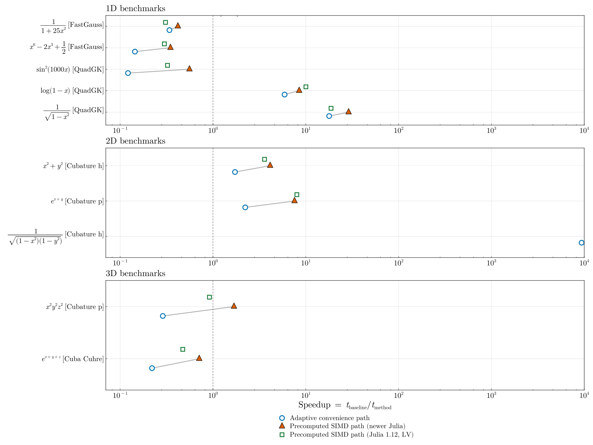

# Benchmarks

This benchmark suite is **accuracy-targeted**, not a fixed-node-count race.
Every method is timed against a common accuracy target, and methods that do not
meet that target are marked explicitly.

Cross-library comparisons include:
- `FastTanhSinhQuadrature.jl`
- `QuadGK.jl`
- `HCubature.jl`
- `Cubature.jl` (`h` and `p` variants)
- `Cuba.jl` (`Vegas`, `Divonne`, `Cuhre`, for >1D)
- `FastGaussQuadrature.jl` (1D only)

## How to Read This Page

- Adaptive libraries are run with the same `rtol` / `atol` targets.
- For each test case, we infer an `N` from the level where `FTS adaptive`
  satisfies the stopping criterion.
- `FTS avx` is benchmarked at that adaptive-matched `N`.
- `FastGauss` (1D) is calibrated independently to the same tolerance target.
- The table therefore reports adaptive tolerance-based runs plus fixed-grid
  comparisons where each method uses its own convergence path.
- Methods marked with `*` did not meet the requested target within the candidate
  node list or evaluation budget.

If you are deciding whether to use this package, the most important distinction
is usually the problem class:

- For endpoint singularities or repeated integrations with pre-computed nodes,
  Tanh-Sinh can be extremely effective.
- For ordinary smooth 1D problems, especially oscillatory ones, `QuadGK.jl`
  is often the better default.

## Methodology

- Domain: case-dependent (most tests use `[-1,1]^d`; oscillatory 1D test uses `[-π,π]`)
- Tolerances: `rtol = 1e-6`, `atol = 1e-8`
- Max evaluations (external adaptive solvers): `200000`
- Timing: `@belapsed` with interpolation (`samples=3`, `evals=1`)
- One warm call is executed before each timed benchmark.
- Adaptive cache construction is excluded from timed regions (prebuilt caches).

For this package we benchmark:
- `adaptive_integrate_*` typed calls (minimal-dispatch adaptive path),
- `quad` convenience calls,
- precomputed-node `_avx` calls at the `N` inferred from adaptive convergence.

The raw benchmark outputs also include absolute and relative errors:

Raw output files are generated at:
- `benchmark/results/timings.csv`
- `benchmark/results/timings_full.md`
- `benchmark/results/timings_summary.md`

## Timing Table at Fixed Accuracy Target

| Dim | Function | FTS adaptive | FTS quad | FTS avx | QuadGK | HCubature | Cubature h | Cubature p | Cuba Vegas | Cuba Divonne | Cuba Cuhre | FastGauss |
| :-- | :------- | ----------: | -------: | ------: | -----: | --------: | ---------: | ---------: | ---------: | -----------: | ---------: | --------: |
| 1D | 1/(1+25x^2) | 735.0000 | 628.0000 | 474.0000 | 1612.0000 | 1.620e+04 | 1.644e+04 | 2.007e+04 | n/a | n/a | n/a | 176.0000 |
| 1D | 1/sqrt(1-x^2) | 574.0000 | 528.0000 | 523.0000 | 1.154e+04 | 2.189e+05 | 2.389e+05 | 2834.0000 * | n/a | n/a | n/a | 1.146e+04 * |
| 1D | log(1-x) | 1013.0000 | 592.0000 | 442.0000 | 5237.0000 | 6.031e+04 | 7.402e+04 | 1356.0000 * | n/a | n/a | n/a | 1.208e+04 |
| 1D | sin^2(1000x) | 1.770e+05 | 2.542e+05 | 2.909e+04 | 1.142e+04 | 1.313e+05 | 1.041e+05 | 1301.0000 * | n/a | n/a | n/a | 3.748e+04 |
| 1D | x^6 - 2x^3 + 0.5 | 1306.0000 | 803.0000 | 335.0000 | 1898.0000 | 4813.0000 | 2249.0000 | 8949.0000 | n/a | n/a | n/a | 118.0000 |
| 2D | 1/sqrt((1-x^2)(1-y^2)) | 3663.0000 | 3660.0000 | 1865.0000 | n/a | 5.218e+07 | 2.832e+07 | 2433.0000 * | 9.357e+07 * | 1.140e+08 * | 9.744e+07 * | n/a |
| 2D | exp(x+y) | 1.864e+04 | 2.438e+04 | 5720.0000 | n/a | 8.769e+04 | 4.420e+04 | 3.861e+04 | 9.402e+07 * | 8.362e+07 | 6.697e+04 | n/a |
| 2D | x^2 + y^2 | 2678.0000 | 2153.0000 | 1968.0000 | n/a | 9986.0000 | 5980.0000 | 9098.0000 | 8.497e+07 * | 7.713e+07 | 6.858e+04 | n/a |
| 3D | 1/sqrt((1-x^2)(1-y^2)(1-z^2)) | 1.168e+05 | 1.153e+05 | 7.367e+04 | n/a | 3.339e+07 * | 3.151e+07 * | 5400.0000 * | 1.320e+08 * | 1.391e+08 * | 1.111e+08 * | n/a |
| 3D | exp(x+y+z) | 1.049e+06 | 1.069e+06 | 3.401e+05 | n/a | 3.619e+05 | 3.170e+05 | 7.207e+05 | 1.178e+08 * | 1.283e+08 * | 1.795e+05 | n/a |
| 3D | x^2*y^2*z^2 | 7.994e+04 | 7.634e+04 | 2.207e+04 | n/a | 1.345e+07 | 8.682e+06 | 2.441e+04 | 1.055e+08 * | 1.318e+08 * | 4.454e+07 | n/a |

`*` indicates the method did not meet the requested tolerance on that case.
`FTS avx` uses the `N` inferred from adaptive FTS convergence.
`FastGauss` (1D) uses its own minimal `N` that meets tolerance (if found).

## Benchmark Summary Figure

This summary shows speedup of `FTS quad` and `FTS avx`
relative to the fastest accurate competing method on each benchmark case.
Values greater than 1 indicate faster performance.



## Running Benchmarks

```bash
julia --project=benchmark benchmark/benchmarks.jl
```
