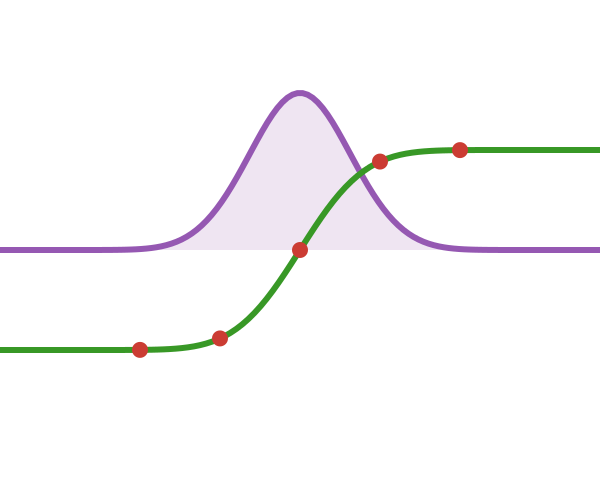

```@meta
CurrentModule = FastTanhSinhQuadrature
```

# FastTanhSinhQuadrature.jl

<p align="center">
  
</p>


**FastTanhSinhQuadrature.jl** is a high-performance Julia library for numerical integration using the [Tanh-Sinh (Double Exponential) quadrature](https://en.wikipedia.org/wiki/Tanh-sinh_quadrature) method.

It handles **singularities at endpoints** robustly, supports **arbitrary precision** arithmetic (e.g., `BigFloat`, `Double64`), and leverages **SIMD** for speed.

## Usage at a Glance

```julia
using FastTanhSinhQuadrature

# 1. Define function
f(x) = x * exp(x)

# 2. Integrate on [-1, 1]
val = integrate(f, 10) # 10 levels
println(val)
```

## Contents

- [Theory](theory.md): Understand the mathematics behind the method.
- [Basic Examples](examples/basics.md): Learn how to integrate simple 1D functions.
- [Advanced Examples](examples/advanced.md): Multidimensional integration and performance tips.
- [Benchmarks](benchmarks.md): Performance comparison against other libraries.
- [API Reference](api.md): Detailed function documentation.

```@index
```


