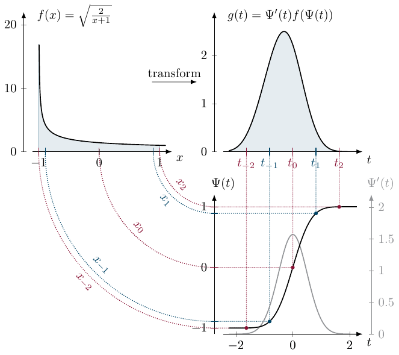

# Tanh-Sinh Quadrature

## Reference

This implementation follows the theoretical framework described in:

> **Tanh-Sinh Quadrature**  
> D.H. Bailey, K. Jeyabalan, and X.S. Li  
> *Experimental Mathematics*, Vol. 14 (2005), pp. 317–329  
> [EMS Press Article](https://ems.press/content/serial-article-files/41766?nt=1)

## Overview

The quadrature computes integrals of the form

```math
\mathcal{I}=\int_{-1}^1 f(x) dx.
```

The method is based on a variable transformation which maps the original domain $x \in (-1,1)$ onto the entire real axis $t \in (-\infty, \infty)$ using the transformation:

```math
x = \Psi(t) = \tanh\left(\frac{\pi}{2} \sinh t\right)
```

The derivative (Jacobian) of this transformation is:

```math
\Psi'(t) = \frac{\frac{\pi}{2} \cosh t}{\cosh^2\left(\frac{\pi}{2} \sinh t\right)}
```

The integral then becomes:

```math
\mathcal{I} = \int_{-\infty}^\infty g(t) dt, \quad g(t)= f(\Psi(t)) \Psi'(t)
```

Since the method is specific for the $x \in (-1,1)$ domain, one must cast the desired integral to this domain by the linear substitution:

```math
x(u)=\frac{b+a}{2}+\frac{b-a}{2}u
```

This transformation changes an arbitrary interval $[a,b]$ to $[-1,1]$, hence

```math
\int_a^b f(x)dx= \frac{b-a}{2}\int_{-1}^1 f(x(u))du = \frac{b-a}{2}\int_{-\infty}^\infty f(x(u(t))) w(t) dt
```

## Transformation Visualization

The key to the Tanh-Sinh quadrature's effectiveness lies in how the transformation maps the integration points. While the discretization in the transformed $t$-domain uses equidistant notes ($t_i = ih$), the mapping $x = \tanh(\frac{\pi}{2} \sinh t)$ causes these corresponding $x_i$ nodes to cluster **double exponentially** fast near the endpoints $-1$ and $+1$ of the original domain. This dense clustering allows the quadrature to accurately resolve functions even when they have singularities at the boundaries, as the weights decay rapidly enough to suppress the singularity.

```@raw html
<div style="text-align: center;">
  
  <br>
  <em>Figure 1: Visualization of the Tanh-Sinh variable transformation. Source: <a href="https://arxiv.org/abs/2007.15057">arXiv:2007.15057</a>.</em>
</div>
```

## Discretization

We approximate the infinite integral using the trapezoidal rule with step size $h$:

```math
\mathcal{I}_h = \sum_{i=-\infty}^{\infty} h g(t_i) = \sum_{i=-\infty}^{\infty} h \Psi'(t_i) f(\Psi(t_i))
```

where $t_i = ih$. Because the transformed integrand $g(t)$ decays double exponentially (like $\exp(-\frac{\pi}{2} e^{|t|})$) as $|t| \to \infty$, we can truncate the infinite sum to a finite window $[-t_n, t_n]$ with negligible error:

```math
\mathcal{I} \approx Q_h^n = \sum_{i=-n}^{n} h \Psi'(t_i) f(\Psi(t_i))
```

## Error Estimation and Convergence

For an integrand $f(x)$ that is regular in a strip of width $d$ in the complex plane around the interval $[-1, 1]$, the error of the tanh-sinh quadrature decreases exponentially with the number of evaluation points $N = 2n+1$. Specifically, the error is of the order:

```math
|\mathcal{I} - Q_h^n| \approx \mathcal{O}\left(\exp\left(-\frac{\pi d N}{\ln(2 d N)}\right)\right)
```

This rapid convergence rate is the hallmark of double exponential formulas. See the [Convergence](convergence.md) page for empirical results.

## Optimal Step Size and Truncation

The choice of the step size $h$ and the number of points $N$ are coupled. To balance the discretization error (from the trapezoidal rule) and the truncation error (from cutting off the infinite sum), the optimal step size $h$ for a given $N$ is approximately:

```math
h_{opt} \approx \frac{2}{N} \ln(\pi d N)
```

However, in floating-point arithmetic, we are limited by the machine precision. We cannot transform points arbitrarily close to $\pm 1$ without hitting the underflow limit or precision bound of the floating-point type.

This leads to a **maximal step size** constraint to ensure numerical stability. If $t_{max}$ is the largest argument such that we can still distinguish $\Psi(t_{max})$ from $1$ (or weights from $0$), then we must have:

```math
h_{max} = \frac{t_{max}}{n}
```

Typically, $t_{max}$ is determined by the condition where the weights $\Psi'(t)$ underflow to zero or the nodes $\Psi(t)$ become indistinguishable from $\pm 1$ in the given precision.

## Numerical Stability Notes

When dealing with finite precision floating point numbers, numerical instabilities can arise.

The quadrature scheme depends crucially on the evaluations very close to the end-points of the integration domain. The most important cause of numerical instabilities is numerical underflow.

Both the smallest weight and abscissa value are determined by the window size $t_n$. The smallest positive normalized floating point number is $F_{\min}=2^L$.

For the weights to avoid the numerical underflow we need:

```math
t_{\max}^w = \max\{ t\,|\, \Psi'(t) \geq F_{\min}\}
```

Similarly the smallest abscissa should exceed the machine epsilon / underflow limit relative to the endpoint:

```math
t_{\max}^x = \max\{ t \,|\, t \leq \Psi^{-1}(1-F_{\min})\}
```

Since these conditions need to be satisfied simultaneously we introduce:

```math
t_{\max}^{xw} = \min\{ t_{\max}^x, \,t_{\max}^w \}
```

It is crucial to ensure $h$ is chosen such that $nh \le t_{max}^{xw}$. These limits ensure that the quadrature points remain within the range where the function $f(x)$ can be reliably evaluated and where the Jacobian weights carry meaningful values without underflowing to zero.

### Adaptive Integration Strategy

To achieve a desired accuracy without manually tuning the number of points $N$, we implement an adaptive refinement strategy:

1. **Grid Refinement**: Starting from a coarse step size $h_0 \approx t_{max}/2$, we halve the step size at each iteration ($h_{k+1} = h_k / 2$).
2. **Node Reuse**: Because $h_{k+1} = h_k / 2$, all nodes from iteration $k$ are preserved in iteration $k+1$ (they correspond to the even-indexed nodes $x_{2i}^{k+1}$).
3. **Efficiency**: At each step, we only evaluate the function at the **new** nodes (odd indices $x_{2i+1}^{k+1}$ in the refined grid). This reduces the number of expensive function calls by a factor of 2 compared to recomputing the whole sum.
4. **Multi-Dimensional Symmetry**: we exploit the symmetry of the Tanh-Sinh weights ($w(t) = w(-t)$) and nodes ($\Psi(t) = -\Psi(-t)$). For 2D and 3D integrals, this means we only iterate over one "corner" of the domain and use reflections (4-way in 2D, 8-way in 3D) to accumulate the final sum.

## Singular Integral Handling

One of the primary advantages of Tanh-Sinh quadrature is its ability to handle **boundary singularities**. Because the transformation maps the endpoints to infinity and clusters points double-exponentially near them, the function is never evaluated exactly at the boundary. For functions like $\int_0^1 \log(x)dx$ or $\int_{-1}^1 (1-x^2)^{-1/2}dx$, the quadrature typically reaches high accuracy without any special treatment.

### Internal Singularities and Domain Splitting

If a singularity exists **inside** the integration domain (e.g., $\int_{-1}^1 |x|^{-1/2}dx$ at $x=0$), the standard Tanh-Sinh approach may fail or converge very slowly because the high-density node regions (the "exponential tails") are at the boundaries, not the interior.

To handle this, we provide the `quad_split` function. It allows the user to specify the location of the internal singularity. The function then:
1. Splits the domain into sub-regions (2 segments in 1D, 4 rectangles in 2D, or 8 boxes in 3D) where the singularity is on the **boundary** of each sub-region.
2. Integrates each sub-region using the standard `quad` function.
3. Sums the results.

This transforms an internal singularity into several boundary singularities, which Tanh-Sinh then handles with its characteristic efficiency.
